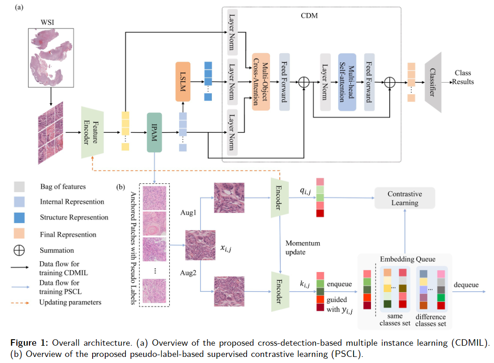

# Optimized Multiple Instance Learning for Brain Tumor Classification Using Weakly Supervised Contrastive Learning
This repository contains the implementation of CLMIL, a two-stage framework for brain tumor classification. The framework consists of:

1. CDMIL (Cross-Detection MIL Aggregator): A model for brain tumor classification using Multiple Instance Learning (MIL).

2. PSCL (Contrastive Learning Model based on Pseudo-Labels): A contrastive learning model to optimize the feature encoder using pseudo-labels.
The model is trained on a single RTX 3080 GPU.
## Requirements
To run the code, you need the following dependencies:
- Python 3.7+
- PyTorch 1.8+
- torchvision
- numpy
- scikit-learn
- spams

(Add any other dependencies your project requires)
 ### Dataset Preparation
The datasets used in this study are accessible through The Cancer Genome Atlas (TCGA) at [https://portal.gdc.cancer.gov/] and the CAMELYON16 challenge at [https://camelyon16.grand-challenge.org/]. The dataset of Meningiomas is available from the corresponding authors upon reasonable request.
 ## Model training and testing
Our framework CLMIL consists of two stages: a cross-detection MIL aggregator (CDMIL) for brain tumor classification and a contrastive learning model based on pseudo-labels (PSCL) for optimizing feature encoder. Generally, we train the model with one RTX 3080 GPU. 
<div align="center">
  
</div>

### Step 1: Train CDMIL (First Stage)
Navigate to the CDMIL directory and run the following command to train the CDMIL model:
```
   cd ../CLMIL/CDMIL
   python train.py
```
### Step 2: Extract Anchor Samples and Pseudo-Labels from IPAM
Once the CDMIL model is trained, you can extract anchor samples and pseudo-labels from the IPAM. These will be used as training data for the PSCL stage.

Run the following script to extract the data:

## Contact
If you have any question, please feel free to contact us. 
